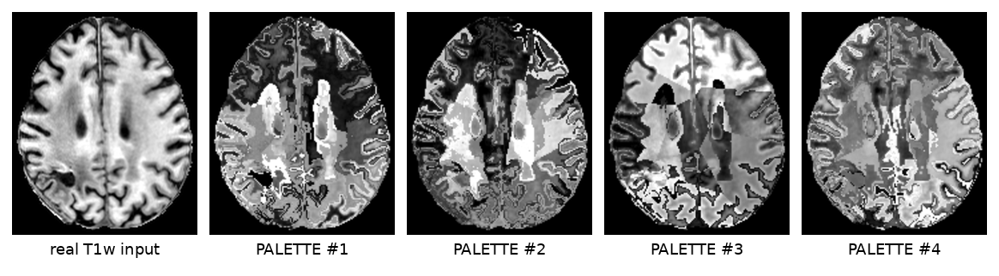
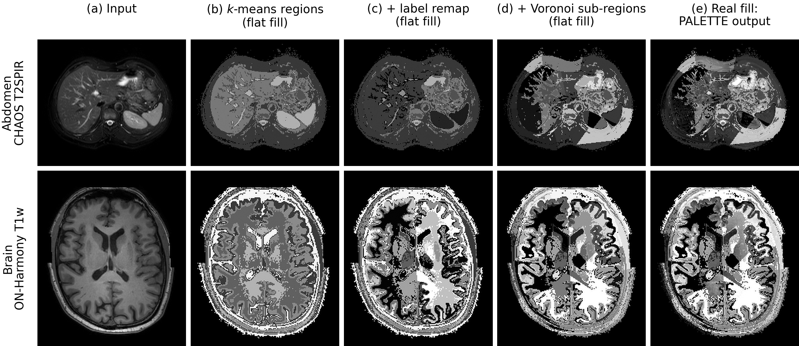
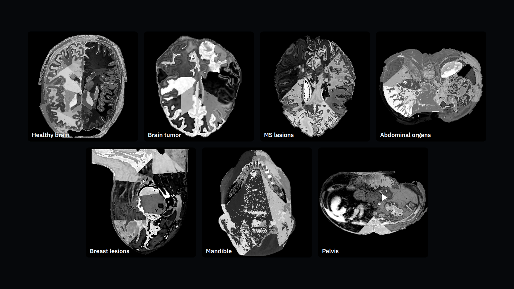
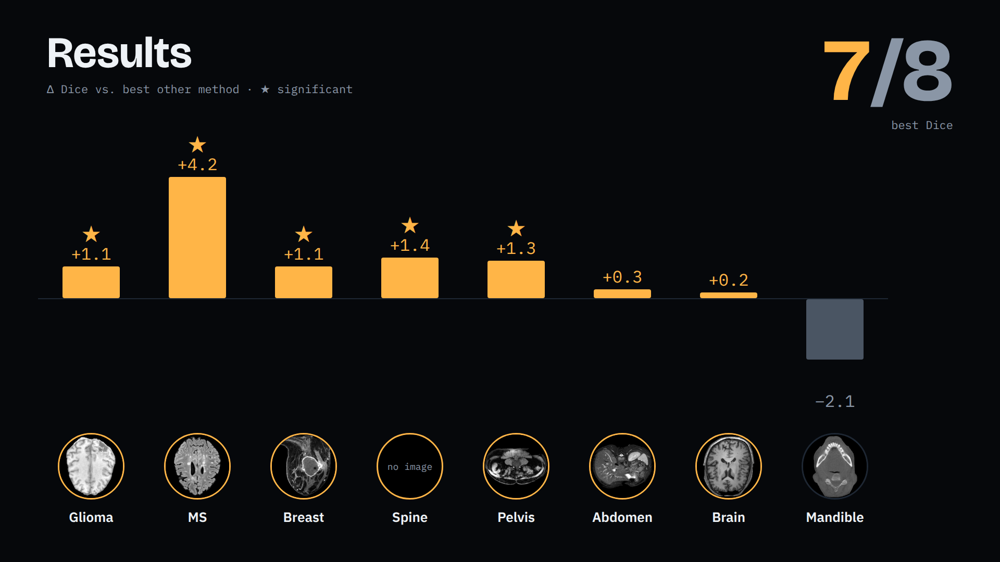
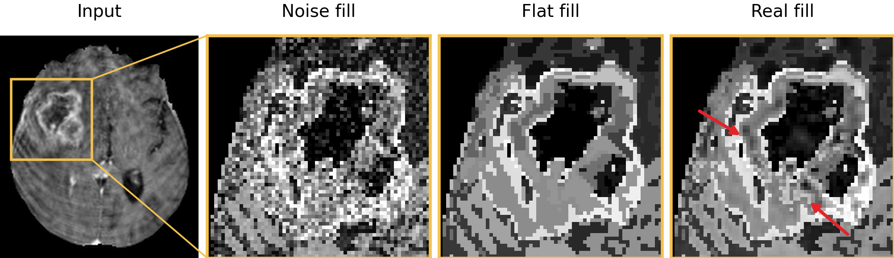
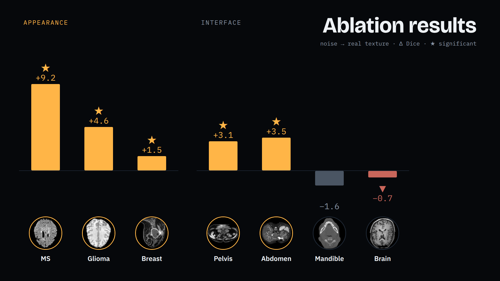

# PALETTE-Aug: Texture-Preserving Augmentation for Medical Imaging Domain Generalization

A segmentation model trained on **one** MRI contrast or imaging modality that still works on contrasts and
modalities it has never seen (T1w, T2w, FLAIR, DWI, GRE, EPI, CT, CBCT), with no retraining, no per-contrast
tuning, and no target domain chosen in advance.


https://github.com/user-attachments/assets/39c7c71e-78d8-451e-a66b-98d192ca12c1


## Why

Segmentation networks trained on one contrast often fail on another, even though the anatomy underneath is
the same, and annotating data for every new contrast is costly. Synthesis-based domain randomization such as
SynthSeg generates training images from label maps alone, but it needs dense label maps and throws away the
texture of the real image. PALETTE-Aug is a texture-preserving alternative: it needs only the task's own
labels, and it randomizes contrast by remapping the **real** intensities of the image, so the texture inside
every region survives.

## What it does

One real T1w scan and four real, unretouched outputs of the PALETTE transform applied to it. Anatomy and
texture stay the same; only contrast changes:



**PALETTE** (*Partition-based Affine Local-intEnsity Transform for Texture-prEserving augmentation*) is a
label-free, on-the-fly contrast augmentation:

1. **k-means** on the foreground intensities gives a handful of intensity classes (no atlas, no labels).
2. **Voronoi sub-parcellation** splits each class into finer spatial regions.
3. **Signed affine remap** of the real intensities in each region, `y = μ + α(x − mean)`, with α of either
   sign, so local contrast can be rescaled or inverted.
4. **Label remap**: the same affine remap applied again inside each ground-truth label, so labeled
   structures get their own contrast.



**PALETTE-Aug** runs PALETTE inside the [Auglab](https://github.com/neuropoly/AugLab) GPU augmentation
pipeline. One configuration, tuned once, is reused unchanged on every task below.

The same transform on training images from seven of the eight tasks:



## Results

Eight segmentation tasks across MRI, CT and dental CBCT: five whose targets are bounded by an anatomical
interface (healthy brain, abdominal organs, healthy spine, mandible, pelvis) and three defined by tissue
appearance (brain tumor, multiple sclerosis lesions, breast lesions). Every method trains on one modality and
is tested both in-domain and on held-out contrasts or modalities it never saw.

PALETTE-Aug has the highest Dice on **seven of the eight tasks**. Δ Dice against the best other method on each
task (★ = significantly better on that task):



With all eight tasks pooled (equal weight per task), it is significantly better than every competitor:

| method | overall Dice ↑ | overall HD95 (mm) ↓ | p vs. PALETTE-Aug (Dice) |
|---|---|---|---|
| nnU-Net (default augmentation) | 35.1 | 64.0 | 3 × 10⁻⁷⁵ |
| SynthSeg-noEM | 33.8 | 89.6 | 2 × 10⁻⁸⁶ |
| SynthSeg-EM | 60.8 | 24.4 | 1 × 10⁻³⁵ |
| Auglab | 61.7 | 24.4 | 1.1 × 10⁻¹³ |
| SRCSM (with test-time source matching) | 53.4 | 33.1 | 8 × 10⁻⁶⁶ |
| **PALETTE-Aug (ours)** | **63.0** | **22.7** | — |

p-values: one-sided paired sign-flip test at the patient level, Holm-corrected over the five competitors.
Per-task tables live in `benchmark/01_commun_results/` and in each task's `8_results_*/` folder.

## Ablation: when does texture matter?

The ablation holds the PALETTE partition fixed and changes only how each region is filled: Gaussian noise
(the SynthSeg-style fill) versus the remapped real intensities. Same regions, same draws, only the texture
differs:



Keeping the real texture raises Dice most on targets defined by tissue appearance: **+9.2** points on MS
lesions and **+4.6** on brain tumor. On interface-bounded targets it gains at most **+3.5**. Breast lesions, also
appearance-defined, gain only **+1.5**:



## Repository layout

```
src/                    PALETTE method source (the contrast transform + model) — no pipeline glue
benchmark/
  00_commun_scripts/     shared train/predict/evaluate/aggregate/significance drivers (canonical)
  01_commun_results/     cross-dataset comparison tables, incl. the headline task-level heatmap
  02_tasks/<task>/<dataset>/   one folder per benchmark dataset, grouped by anatomy/pathology
  03_archive/            excluded or superseded datasets, kept for history
scripts/                 cluster job submission (run_job), venv setup, cross-cutting tooling
sub-workspaces/          AugLab (external GPU augmentation library this method builds on)
paper/                   CVPR paper source
```

Every dataset under `benchmark/02_tasks/` follows the same structure — raw data, BIDS, nnU-Net
conversion, splits, pipeline scripts, checkpoints, results, tests — so all datasets train, predict,
evaluate and aggregate identically. This is deliberate: it's what makes the numbers above directly
comparable across 8 completely different anatomical structures. See `CLAUDE.md` for the full
convention if you're adding a new dataset or method.

## Installation

Requires Python 3.11 and an nnU-Net v2 training environment.

```bash
module load python/3.11        # or your own Python 3.11 install
python3 -m venv .venv
source .venv/bin/activate
```

The full, tested dependency recipe (including several packages that need pinning or pre-downloading
to avoid silent version backtracking) lives in `scripts/job_runner/_setup_venv_oneshot.sh` — run it
inside a batch job on an HPC cluster, or adapt it for a local/interactive install. It also registers
this project's nnU-Net trainer classes and pulls in AugLab:

```bash
git clone https://github.com/neuropoly/AugLab.git sub-workspaces/auglab_workspace/AugLab
pip install -e sub-workspaces/auglab_workspace/AugLab
```

## Running an experiment

Every train / predict / evaluate / aggregate step goes through the shared drivers in
`benchmark/00_commun_scripts/` — never call `nnUNetv2_train`/`nnUNetv2_predict` directly. A new
dataset gets scaffolded, not hand-written:

```bash
.venv/bin/python benchmark/create_dataset_structure.py <dataset_name>
```

To train the full 6-method suite (nnU-Net baseline, two SynthSeg variants, Auglab default, SRCSM, PALETTE-Aug)
on one modality of an existing dataset:

```bash
bash benchmark/02_tasks/<task>/<dataset>/5_scripts_<dataset>/04_train/04_XX_run_all_<modality>.sh
```

then predict, evaluate, and aggregate the same way — one config-driven command per step:

```bash
bash .../05_predict/05_01_predict_common.sh <run_id>
bash .../06_evaluate/06_01_evaluate_run.sh <run_id>
bash .../06_evaluate/06_02_aggregate_from_config.sh configs/<dataset>_<modality>_01_results.yaml
```

Before trusting any change to shared code, run the structure validator (it checks both the 9-subdir
layout and the canonical script-numbering convention across every dataset):

```bash
.venv/bin/python benchmark/validate_standard_dataset_structure.py
```

**This project runs on shared HPC clusters (Vulcan / TamIA / Killarney via the Digital Research
Alliance of Canada).** All heavy compute goes through Slurm, never a login node — see `CLAUDE.md`
for cluster-specific submission, storage and GPU policy if you're running this on one of them.

## Citation

Paper source and build instructions are under `paper/`. Citation details will be added once
published.
